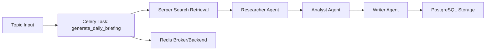

# Architecture

This project orchestrates retrieval, role-based reasoning, and persistence through a background-job pipeline.

## Data Flow

The task worker pulls a topic from Redis-backed Celery queues, retrieves sources, runs role-specific reasoning, and stores final outputs in PostgreSQL.
