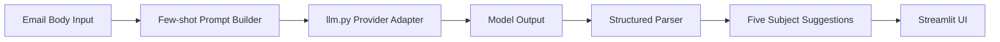

# Architecture

The app uses a deterministic post-processing layer so UI output always contains exactly five subject suggestions.

## Data Flow

Input text is transformed into a few-shot prompt, generated through the provider adapter, parsed into structured output, and displayed in Streamlit.
