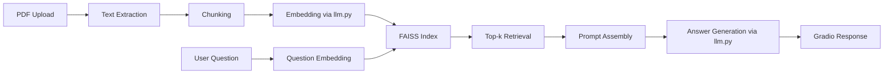

# Architecture

This project implements a classic retrieval-augmented generation (RAG) pipeline for PDF question answering.

## Plain-English Flow

1. User uploads a PDF in Gradio.
2. The app extracts text from all pages.
3. The text is chunked into overlapping segments.
4. Chunks are embedded with the project `llm.py` adapter.
5. Embeddings are indexed in FAISS.
6. A user question is embedded and nearest chunks are retrieved.
7. Retrieved chunks plus question are assembled into a grounded prompt.
8. The model generates a final answer.

## Mermaid Diagram

