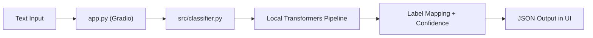

# Architecture

This project keeps inference logic separate from UI code and runs fully locally.

## Data Flow

The app receives user text, runs local model inference, applies threshold-based neutral handling, and returns a structured result.
