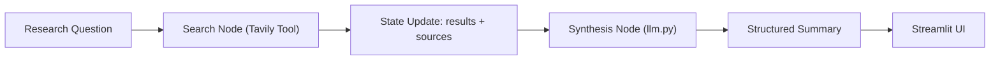

# Architecture

This project uses a stateful workflow where one node gathers evidence and another node synthesizes findings.

## Data Flow

State management keeps question, search results, sources, and summary in a single structured object passed between workflow stages.
