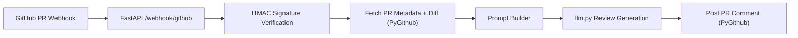

# Architecture

This service receives GitHub webhooks, verifies authenticity, builds a review prompt from PR diff context, and posts a comment back to GitHub.

## Data Flow

Security-critical logic (signature verification) runs before any expensive processing or outbound API calls.
