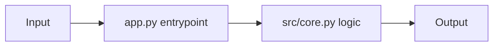

# Architecture

This template separates user-facing entrypoints from reusable core logic.

## Data Flow

Input text enters through `app.py`, gets validated and transformed in `src/core.py`, and then returns as output.
