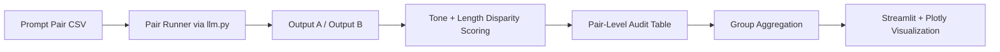

# Architecture

This module executes counterfactual prompt pairs, computes disparity heuristics, and visualizes group-level patterns.

## Data Flow

The design supports iterative auditing by keeping prompts, outputs, scores, and grouped summaries explicit.
