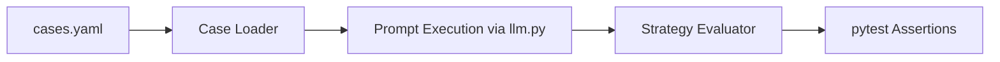

# Architecture

This module loads YAML test cases, executes prompts, evaluates outputs by strategy, and reports results through pytest assertions.

## Data Flow

The evaluator supports exact match, contains checks, and LLM-as-judge with explicit PASS/FAIL verdict parsing.
