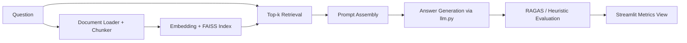

# Architecture

This module combines retrieval, generation, and evaluation in a single feedback loop.

## Data Flow

The architecture is intentionally modular so teams can tune retrieval, prompt style, and evaluation independently.
