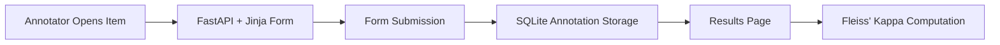

# Architecture

This module combines server-rendered annotation forms with SQLite persistence and agreement computation.

## Data Flow

Human ratings are stored as structured rubric scores, then aggregated into inter-annotator agreement signals for quality analysis.
