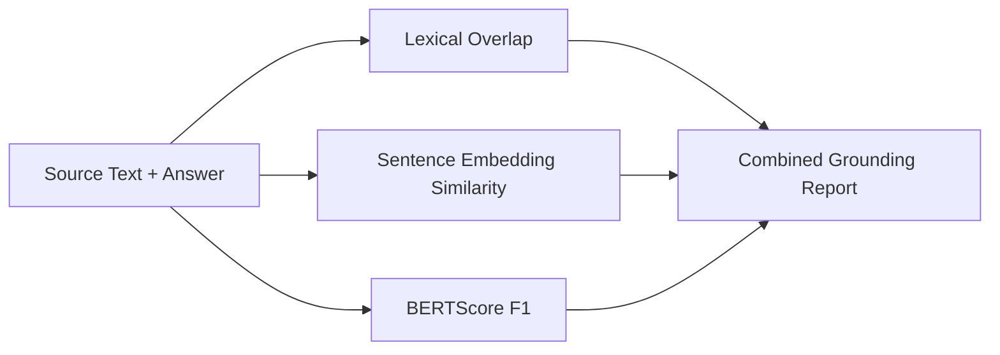

# Architecture

This module computes grounding signals entirely locally and aggregates them into an interpretable score set.

## Data Flow

The module emphasizes metric interpretation and limitations instead of treating any single score as ground truth.
