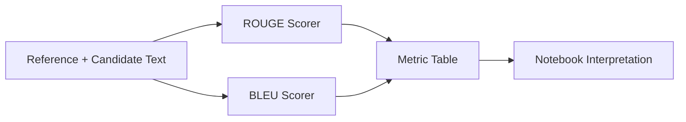

# Architecture

This module computes ROUGE and BLEU from reference/candidate pairs and surfaces interpretation guidance in a notebook.

## Data Flow

The architecture intentionally combines computation with explanatory context to reduce metric misuse.
