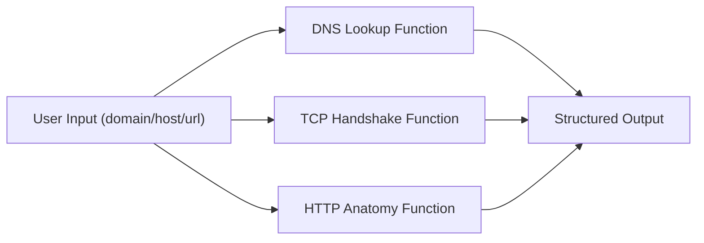

# Architecture

This module provides three independent observational functions for DNS, TCP, and HTTP concepts.

## Data Flow

All functions prioritize explanation and diagnostics rather than offensive behavior.
