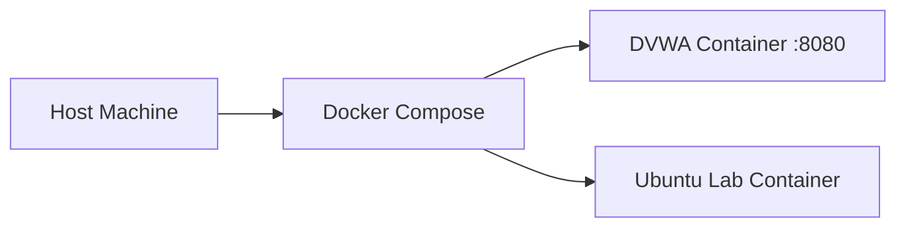

# Architecture

This module creates two isolated containers for safe practice.

## Data Flow

```mermaid
flowchart LR
  A["Host Machine"] --> B["Docker Compose"]
  B --> C["DVWA Container :8080"]
  B --> D["Ubuntu Lab Container"]
```

All testing should remain inside these local containers unless explicitly authorized otherwise.
