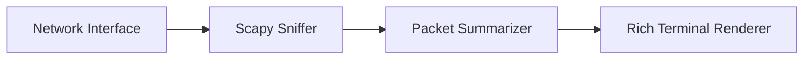

# Architecture

This module captures packets from a selected interface and renders protocol summaries in real time.

## Data Flow

The pipeline is read-only and designed for defensive observability in authorized environments.
