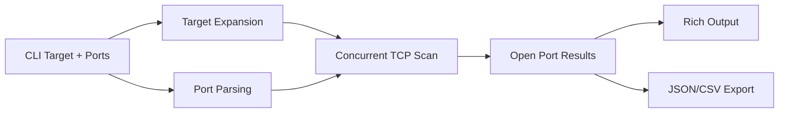

# Architecture

This tool expands targets, parses ports, scans concurrently, and exports open-port findings.

## Data Flow

Concurrency improves scan speed by overlapping network wait time across many sockets.
