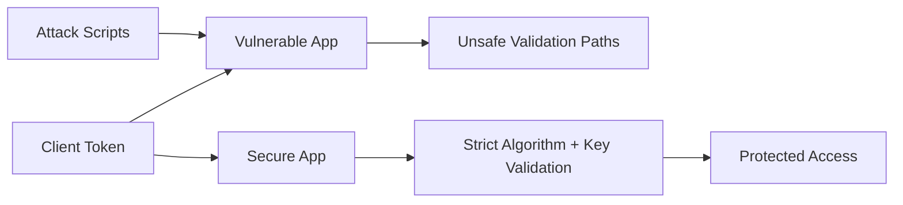

# Architecture

This module separates insecure and secure JWT validation paths for side-by-side learning.

## Data Flow

The vulnerable app intentionally demonstrates anti-patterns, while the secure app enforces best-practice verification.
