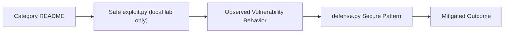

# Architecture

This module organizes each OWASP category as a self-contained learning unit with attack simulation and defense example.

## Data Flow

Each unit pairs demonstration with mitigation to reinforce defensive engineering practice.
