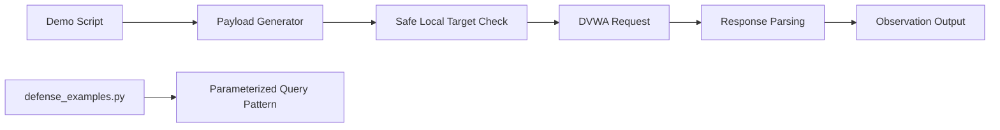

# Architecture

This module separates payload generation, safe request execution, and defensive query patterns.

## Data Flow

The offensive demonstrations remain restricted to local lab targets and are paired with defensive implementation examples.
